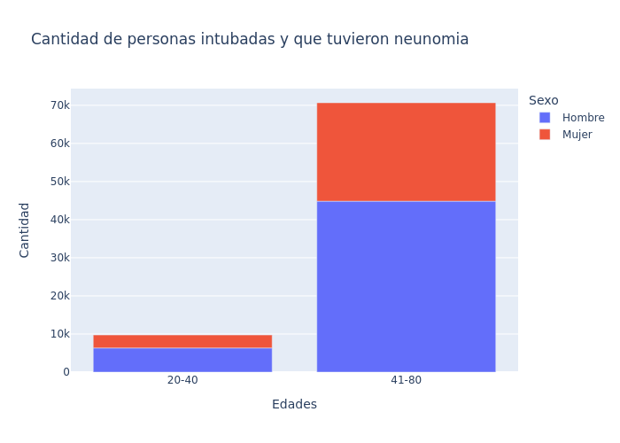

## Trabajo Final Curso Herramientas de Productividad para Ciencia de Datos
### Introducción 
Esta es una pagina para explicar una problematica con un dataset de la [dirección general de epidemiología](https://www.gob.mx/salud/documentos/datos-abiertos-152127). Utilizando un docker file y herramientas vistas en el curso se resolvera esta problematica.

Se busca graficar la cantidad de personas con covid que estan entubadas y que tuvieron neumonia en edades de entre 20 y 40 y mas de 40 y comparando entre hombres y mujeres.

```markdown
Syntax highlighted code block

# Header 1
## Header 2
### Header 3

- Bulleted
- List

1. Numbered
2. List

**Bold** and _Italic_ and `Code` text

[Link](url) and 
```
